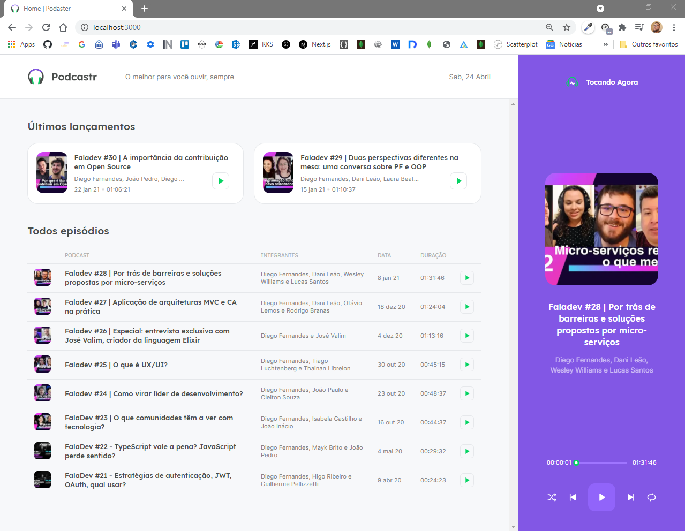

# PODCASTR NEXT

### O podcastr é um App desenvolvido durante a Next Level Week (NLW) 5
---
<p align="center">
  
</p>

<br />

## 🚀 Tecnologias
- 🔗 [ReactJS](https://reactjs.org/)
- 🔗 [NextJS](https://nextjs.org/) 
--- 
## Sobre o podcastr
Aplicação para ouvir podcast, com funcionalidades simples para o usuario e rico conteudo para  dev's.

## Fundamentos do React
- Fluxo de API
- Componente
- Propriedade
- Estado
- Limitações do React
- SPA: single page application
- SSR: server side rendering
- SSG: static side generation

## Criação de projeto Next.js
- Porque TypeScript
- Criando estilos globais
- Como utilizar estilização com css.modules
- Configuração de SASS
- Configuração de fontes externas
- Criação de componente: Header
- Criação de componente: Player
- Criando API utilizando JSON-Server
- Consumindo API usando AXIOS
- Diferenças entre SPA, SSR, SSG
- Criação da HOME de forma estática
  - Geração de BUILD do projeto 
  - Como o projeto rodaria em produção
- Como funciona o roteamento dentro do Next.js
  - Quando criamos um arquivo, o next cria uma rota automaticamente
  - Utilização de [] pra criar uma rota dinamica
- Paginas estaticas e dinamicas com:
  - getStaticPaths

## Fallback
- Conceitos de utilização
  - Quando lhe dar com uma pagina gerada na build ou não
  - Pagina gerada estatica apenas quando o cliente acessa

## Context API
- Entendendo a utilização de contextos e seus beneficios
- Utilização de REFs para manipulação de elementos nativos do HTML
- Ouvir eventos de dentro dos elementos

## Funcionalidades do player
- Funcionalidades completas
  - Play
  - Pause
  - Loop
  - Shuffle
  - Controle de tempo atual
  - Controle pelo Slider


## getting started
```
- Clone este repositório
- rode yarn
- rode yarn dev
```


### Autor
Feito com ❤️ por Rafael D Silva